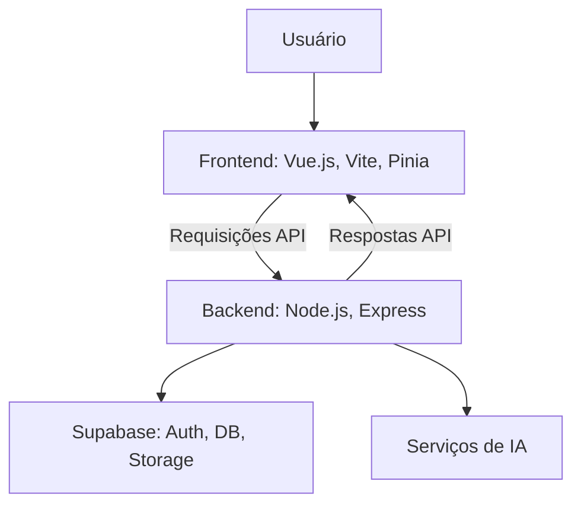

# Arquitetura Geral do Sistema

O diagrama abaixo ilustra a interação de alto nível entre os principais componentes do Finvy.

```mermaid
graph TD
    User[Usuário] --> Frontend[Frontend: Vue.js, Vite, Pinia]
    Frontend -->|Requisições API| Backend[Backend: Node.js, Express]
    Backend -->|Respostas API| Frontend
    Backend --> Supabase[Supabase: Auth, DB, Storage]
    Backend --> ExternalAI[Serviços de IA]
```