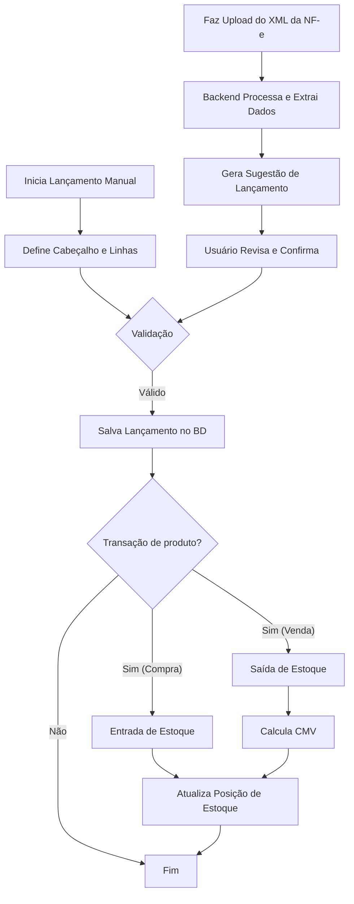

# Fluxo de Operações Diárias

Este fluxo mostra como as transações do dia a dia, como lançamentos manuais e importação de NF-e, são processadas e como elas afetam o controle de estoque.

```mermaid
graph TD
    A_MANUAL[Inicia Lançamento Manual] --> B[Define Cabeçalho e Linhas]
    A_NFE[Faz Upload do XML da NF-e] --> D[Backend Processa e Extrai Dados]
    D --> E[Gera Sugestão de Lançamento]
    E --> F[Usuário Revisa e Confirma]

    B --> G{Validação}
    F --> G

    G -- Válido --> H[Salva Lançamento no BD]
    H --> I{Transação de produto?}
    
    I -- Sim (Compra) --> J_IN[Entrada de Estoque]
    J_IN --> L[Atualiza Posição de Estoque]

    I -- Sim (Venda) --> J_OUT[Saída de Estoque]
    J_OUT --> K[Calcula CMV]
    K --> L

    I -- Não --> M[Fim]
    L --> M
```
