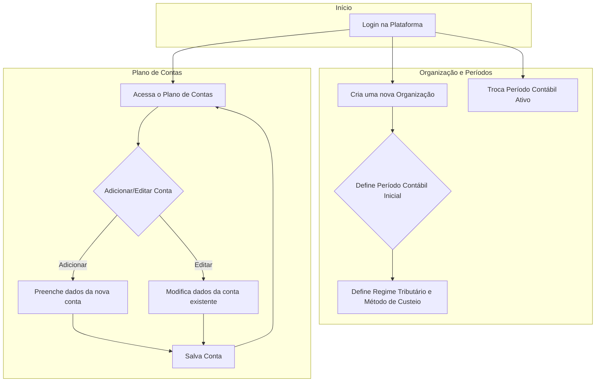

# Fluxo de Configuração Inicial

Este fluxo descreve como um usuário configura uma nova organização e seus elementos fundamentais, como o período contábil e o plano de contas.

```mermaid
graph TD
    subgraph "Início"
        A[Login na Plataforma]
    end

    subgraph "Organização e Períodos"
        B[Cria uma nova Organização] --> C{Define Período Contábil Inicial}
        C --> D[Define Regime Tributário e Método de Custeio]
        E[Troca Período Contábil Ativo]
    end

    subgraph "Plano de Contas"
        F[Acessa o Plano de Contas] --> G{Adicionar/Editar Conta}
        G -- Adicionar --> H[Preenche dados da nova conta]
        G -- Editar --> I[Modifica dados da conta existente]
        H --> J[Salva Conta]
        I --> J
        J --> F
    end
    
    A --> B
    A --> E
    A --> F
```