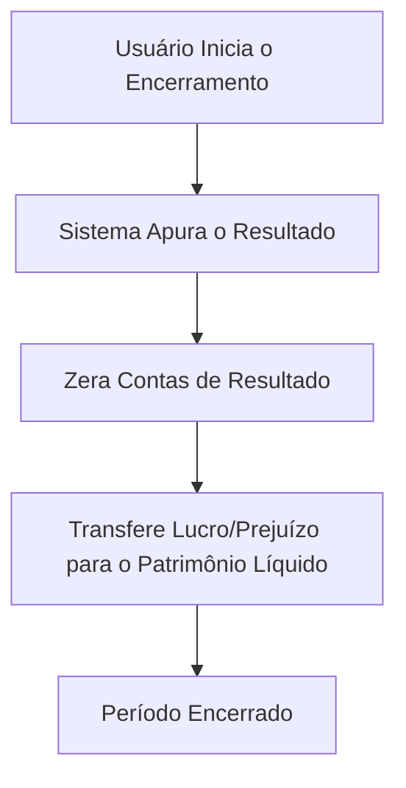

# Fluxo de Análise e Encerramento

Este fluxo detalha como os dados registrados são transformados em relatórios financeiros e como o ciclo contábil é concluído.

## Fluxo de Geração de Relatórios

```mermaid
graph TD
    A[Acessa a Área de Relatórios] --> B{Seleciona o Tipo de Relatório};
    B --> C1[Gera Balancete];
    B --> C2[Gera DRE];
    B --> C3[Gera Balanço Patrimonial];
    B --> C4[Gera Razonete/Ficha de Estoque];
    
    C1 --> D[Define Período/Filtros];
    C2 --> D;
    C3 --> D;
    C4 --> D;
    
    D --> E[Sistema Consulta e Calcula Dados];
    E --> F[Exibe Relatório na Tela];
    F --> G[Opção de Exportar (PDF, XLSX)];
```

## Fluxo de Encerramento do Exercício

