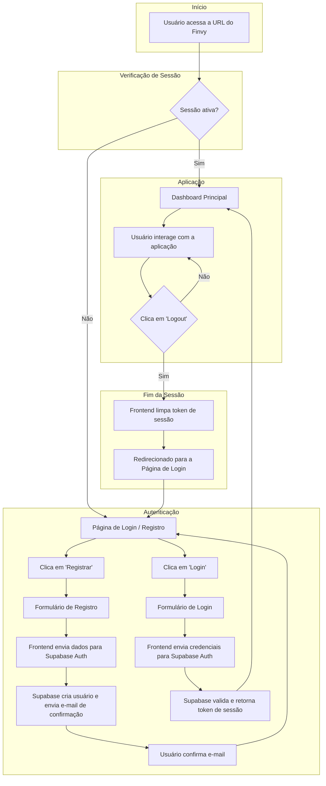

# Fluxo de Interação do Usuário

Este diagrama detalha a jornada do usuário desde o primeiro acesso, passando pelo registro e login, até o encerramento da sessão.

```mermaid
graph TD
    subgraph "Início"
        A[Usuário acessa a URL do Finvy]
    end

    subgraph "Verificação de Sessão"
        B{Sessão ativa?}
    end

    subgraph "Autenticação"
        C[Página de Login / Registro]
        D_REG[Clica em 'Registrar'] --> F[Formulário de Registro]
        F --> G[Frontend envia dados para Supabase Auth]
        G --> H[Supabase cria usuário e envia e-mail de confirmação]
        H --> I[Usuário confirma e-mail] --> C
        
        D_LOGIN[Clica em 'Login'] --> K[Formulário de Login]
        K --> L[Frontend envia credenciais para Supabase Auth]
        L --> M[Supabase valida e retorna token de sessão]
    end

    subgraph "Aplicação"
        E[Dashboard Principal]
        P[Usuário interage com a aplicação]
        Q{Clica em 'Logout'}
    end

    subgraph "Fim da Sessão"
        R[Frontend limpa token de sessão]
        S[Redirecionado para a Página de Login]
    end

    A --> B
    B -- Sim --> E
    B -- Não --> C

    C --> D_REG
    C --> D_LOGIN

    M --> E

    E --> P
    P --> Q
    Q -- Sim --> R
    R --> S
    S --> C
    Q -- Não --> P
```